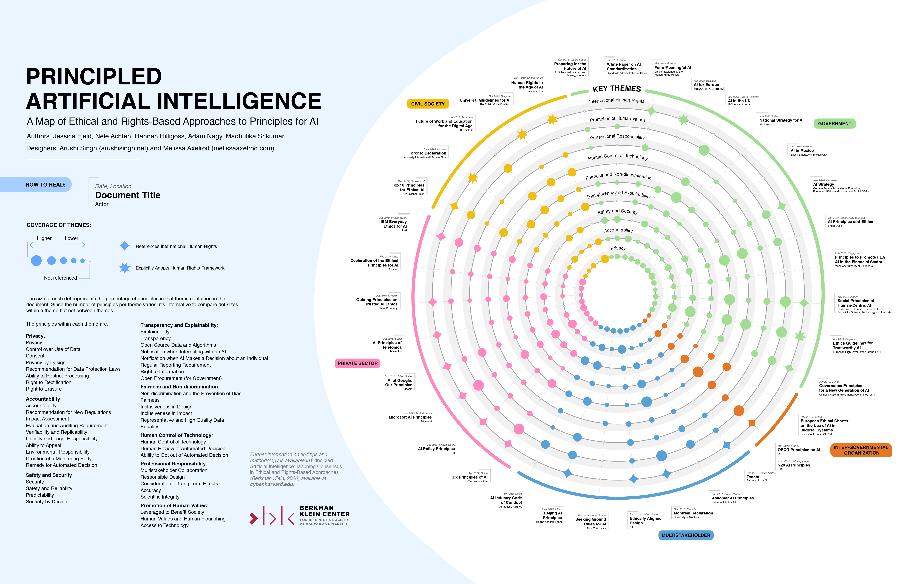

# AI Governance and Ethics resources

## Curated

- [Principled Artificial Intelligence](https://cyber.harvard.edu/publication/2020/principled-ai)
- 
- 

## Regulations

- [European approach to artificial intelligence](https://digital-strategy.ec.europa.eu/en/policies/european-approach-artificial-intelligence)
- [EU AI Act](https://artificialintelligenceact.eu/)
- [What the draft European Union AI regulations mean for business](https://www.mckinsey.com/capabilities/quantumblack/our-insights/what-the-draft-european-union-ai-regulations-mean-for-business)
- [JSON Spec for Transparency Obligations of the EU AI Act](https://huggingface.co/datasets/AdrianGonzalezSanchez/AISBOM)

## Standards

- [ISO - Responsible AI](https://www.iso.org/artificial-intelligence/responsible-ai-ethics)
- [ISO](https://www.iso.org/search.html?PROD_isoorg_en%5Bquery%5D=artificial%20intelligence)
- [ISO - IEC 42001](https://www.iso.org/obp/ui/en/#iso:std:iso-iec:42001:ed-1:v1:en)

## Industry

- [Generative AI governance framework](https://www.genai.global/solutions/framework)
- [Microsoft](https://www.microsoft.com/en-us/ai/tools-practices)
- [IBM](https://www.ibm.com/think/topics/responsible-ai)
- [Google](https://ai.google/static/documents/EN_US-AI-Principles.pdf)
- [Capgemini](https://www.capgemini.com/wp-content/uploads/2020/10/AI-and-the-Ethical-Conundrum-Report.pdf)

## Country specific

### France

- [BPI France](https://bigmedia.bpifrance.fr/nos-dossiers/comment-deployer-une-ia-responsable-dans-votre-entreprise)
- [Impact AI](https://www.impact-ai.fr/fr/ia-responsable-2/)
- [Afnor](https://www.afnor.org/actualites/une-norme-et-une-certification-qualite-pour-lia/)

### Canada

- [BDO](https://www.bdo.ca/insights/responsible-ai-guide-a-comprehensive-road-map-to-an-ai-governance-framework)